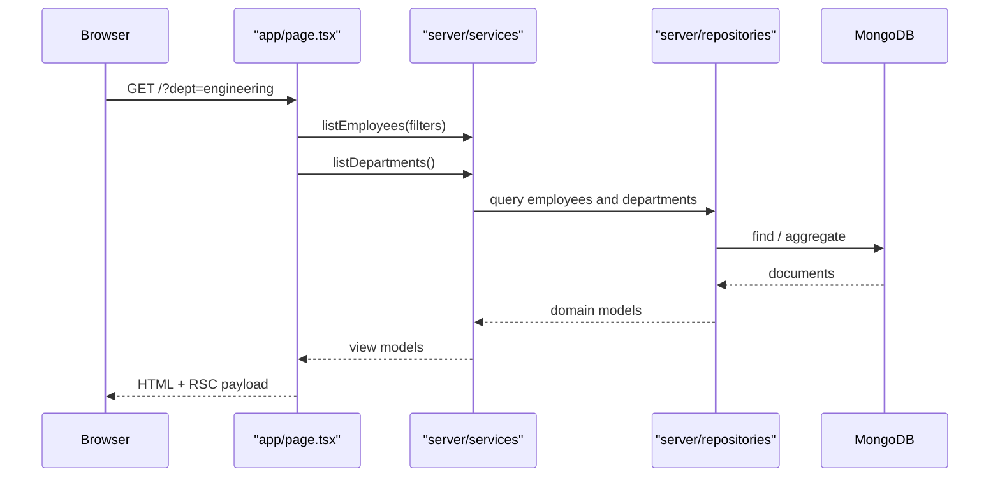
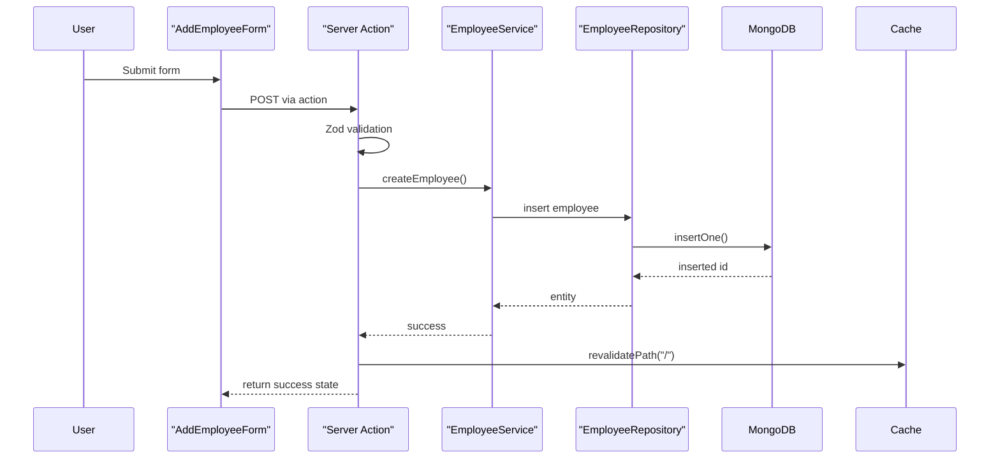

# Architecture / HLD

This document is the high-level design for the employee directory.


## Goals

1. Build a fast employee directory UI with **Next.js App Router**.
2. Keep the UI server-rendered so the page works without browser-side API calls.
3. Expose JSON APIs from the same app for testing and integration.
4. Use MongoDB directly with the native driver and a singleton client.
5. Use `$lookup` only where the joined data is actually needed.
6. Keep the codebase organized so it can grow without becoming a single-file mess.

## Core Design Decision

The app should be a **single Next.js full-stack project**:

- **Presentation layer**: `app/` pages, loading skeletons, error boundaries, client components
- **Application layer**: server actions and route handlers
- **Domain/data layer**: services, repositories, MongoDB client, schemas, and helpers

This gives you two important behaviors:

- When the **frontend is running**, the server components can render the UI directly from MongoDB.
- When you want to test the **backend API surface**, the route handlers are available under `/api/v1`.

So the browser does not need to call the app's own APIs to render the UI.

## Request Flow

### Home Page



### Add Employee



## Architecture Layers

### 1. `app/` - Routes and special files

Responsibilities:

- `page.tsx` renders the employee list page
- `employee/[id]/page.tsx` renders the detail page
- `loading.tsx` shows skeletons while data streams in
- `error.tsx` catches route-level runtime errors
- `not-found.tsx` handles missing employees
- `api/v1/*` exposes JSON route handlers

### 2. `components/` - UI building blocks

Responsibilities:

- Department filter
- Employee cards or table rows
- Add employee form
- Skeletons, buttons, inputs, cards

Client components should be limited to interactive UI only:

- department filter
- form controls
- toast/state feedback

### 3. `lib/` - Shared pure code

Responsibilities:

- Zod schemas shared by client and server
- Formatting helpers
- Slug helpers
- Route constants
- Query param parsing helpers

Keep anything in `lib/` free of Mongo imports so it can safely be used in the browser.

### 4. `server/` - Backend logic inside Next.js

Responsibilities:

- MongoDB connection singleton
- Repository interfaces and implementations
- Business services
- Server Actions
- Data transfer objects / model converters


## Directory Structure

```text
src/
├── app/
│   ├── api/
│   │   └── v1/
│   │       ├── departments/
│   │       │   └── route.ts
│   │       ├── employees/
│   │       │   ├── route.ts
│   │       │   └── [id]/
│   │       │       └── route.ts
│   │       └── health/
│   │           └── route.ts
│   ├── employee/
│   │   └── [id]/
│   │       ├── error.tsx
│   │       ├── loading.tsx
│   │       └── page.tsx
│   ├── error.tsx
│   ├── globals.css
│   ├── layout.tsx
│   ├── loading.tsx
│   ├── not-found.tsx
│   └── page.tsx
├── components/
│   ├── employee/
│   │   ├── add-employee-form.tsx
│   │   ├── department-filter.tsx
│   │   ├── employee-card.tsx
│   │   ├── employee-grid.tsx
│   │   └── employee-table.tsx
│   └── ui/
│       ├── button.tsx
│       ├── card.tsx
│       ├── input.tsx
│       ├── select.tsx
│       └── skeleton.tsx
├── lib/
│   ├── formatting/
│   │   ├── currency.ts
│   │   └── slug.ts
│   ├── validation/
│   │   ├── employee.schema.ts
│   │   └── query.schema.ts
│   └── constants/
│       └── routes.ts
└── server/
    ├── actions/
    │   └── employee.actions.ts
    ├── db/
    │   ├── collections.ts
    │   ├── indexes.ts
    │   └── mongodb.ts
    ├── models/
    │   ├── department.ts
    │   ├── employee.ts
    │   ├── requests.ts
    │   ├── responses.ts
    │   └── errors.ts
    ├── repositories/
    │   ├── department.repository.ts
    │   ├── department.repository.mongo.ts
    │   ├── employee.repository.ts
    │   └── employee.repository.mongo.ts
    └── services/
        ├── department.service.ts
        └── employee.service.ts
```

## MongoDB Design

### Collections

#### `departments`

Fields:

- `_id`
- `name`
- `floor`
- `createdAt`
- `updatedAt`

Suggested index:

- unique index on `name`

#### `employees`

Fields:

- `_id`
- `name`
- `position`
- `salary`
- `departmentId`
- `createdAt`
- `updatedAt`

Suggested indexes:

- `departmentId`
- compound index on `{ departmentId, name }`
- text or case-insensitive search support on `name` and `position`
- sort support on `salary` and `createdAt`

### Relationship

`employees.departmentId` references `departments._id`.

For the detail page, employee fetches should use `$lookup` to hydrate the nested department object.

## Query Contract

### Employees list

Recommended API query params:

- `page`
- `size`
- `search`
- `department_id`
- `salary_min`
- `salary_max`
- `sort_by`
- `sort_order`
- `expand`

Notes:

- `expand=department` is optional and can return minimal department summary data.
- The home page URL can use `dept` as a UI-friendly slug, then resolve it to `department_id` server-side.
- The backend API should still accept `department_id` directly because that is the canonical relationship key.

### Departments list

Recommended API query params:

- `page`
- `size`
- `search`
- `floor`
- `sort_by`
- `sort_order`
- `include_employee_count`

## Caching Strategy

Use Next.js caching on read helpers:

- Cache department lists
- Cache employee lists by filter key
- Optionally cache employee detail by ID

On insert:

- `revalidatePath('/')` after `addEmployee`
- If you later add department counts on the homepage, invalidate that data as well

Important:

- The cache should live in the **server data layer**, not in client state.
- The page should still render without a browser round-trip to the API route.

## Error Handling

Use route-level and page-level boundaries:

- `app/error.tsx` for global route failures
- `app/employee/[id]/error.tsx` for detail page failures
- `app/employee/[id]/loading.tsx` for skeletons
- `app/not-found.tsx` when an employee does not exist

Expected errors should return structured validation messages rather than throwing where possible.

## Validation Strategy

Use shared Zod schemas in both places:

- client component form validation for UX
- server action validation for security

For the list query params, validate and normalize:

- page/size must be positive integers
- salary range must be valid
- sort field and sort order must be whitelisted
- invalid department filters should fail gracefully

## Frontend Behavior

### URL-driven filtering

The department filter should use the URL as the single source of truth.

Good pattern:

- `useSearchParams()` reads the current filter state
- `useRouter().replace()` updates the query string
- the server component re-renders with the new filter

This avoids `useState` for filter state and keeps the page shareable/bookmarkable.

### Accessible UI

Use semantic HTML:

- `main`
- `section`
- `form`
- `label`
- `button`

Keep focus rings visible and ensure skeletons convey loading without blocking keyboard navigation.

## Assumptions

1. The project is a **single Next.js app** that serves both the UI and the JSON APIs.
2. The requirement typo `departmentld` is normalized to `departmentId`.
3. Departments are treated as reference data and do not need CRUD unless you later request it.
4. The frontend does not need browser-side API calls to render the pages.

